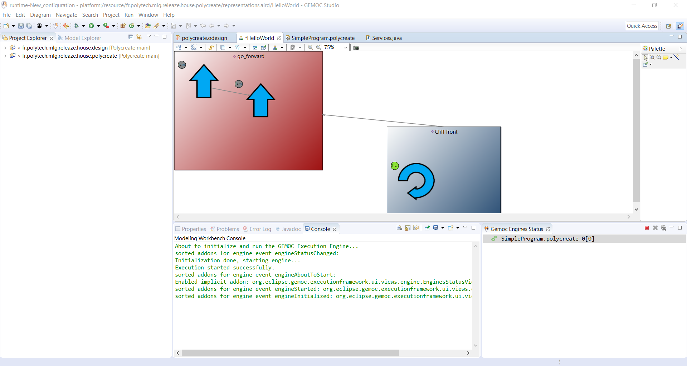

# Program design

States are logically contained within events, but in the visualization, this is represented by an arrow, which points out which events will be triggered when we are in a certain state.

Also, states loop on themselves when they are not interrupted by an event or when a goto is not triggered.

Example of program: 

